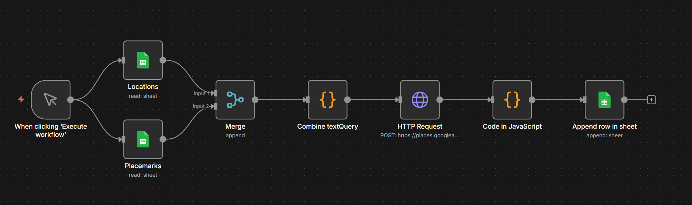
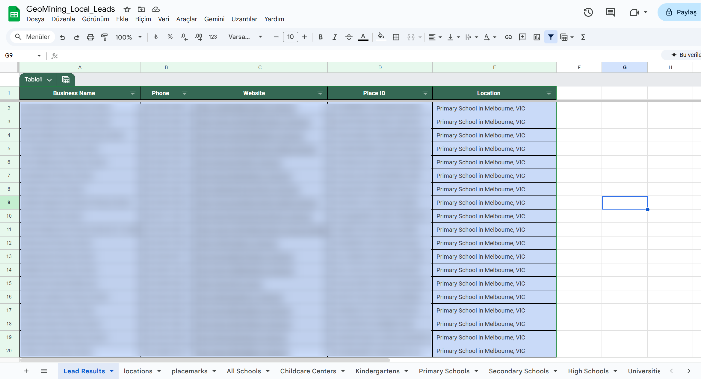

# **Automated Local Lead Generation & Data Mining**
This project is a sophisticated automation workflow built on n8n that extracts business data (Name, Phone, Website, etc.) from specific industries and geographical locations. By integrating the Google Places API (v1), it eliminates manual search processes and streams structured data directly into Google Sheets.

## **Project Purpose**
To empower marketing and sales teams by identifying potential leads in targeted regions, gathering their contact details in a structured format, and eliminating 100% of the time lost to manual data entry.

## **Technical Stack**
n8n: Workflow automation and node management.

**Google Places API (v1):** Used for advanced local search and business detail extraction.

**Google Sheets:** Serves as the dynamic database for storing retrieved leads.

**JavaScript (Node.js):** Custom Code nodes used for data processing, filtering, and query logic.

## **Workflow Logic**
Data Ingestion: The workflow triggers and fetches target cities and business categories from two separate Google Sheet tabs: Locations and Placemarks.

**Dynamic Query Generation:** A JavaScript-based node merges these inputs to create search strings (e.g., "Melbourne in Dentists").

**API Integration:** The HTTP Request node sends a POST request to the Google Places API. It utilizes a FieldMask to request only essential data (ID, Phone, Website, Display Name), optimizing performance and cost.

**Data Normalization:** A second JavaScript node flattens the complex, nested JSON response from the API into a clean, row-based format suitable for spreadsheets.

**Automated Logging:** The processed leads are appended to the Lead Results sheet in real-time.

**Challenges & Engineering Solutions**
**1. Handling Nested API Responses**
-The Issue: The Google Places API returns data in deeply nested arrays, which cannot be mapped directly to spreadsheet columns.

+The Solution: I implemented a custom JavaScript function to map the API response, ensuring that each business is treated as a flat object while preserving the original search_location for context.

**2. Scalable Query Management**
-The Issue: The need to scan multiple locations for multiple business types simultaneously.

+The Solution: I used a Merge node combined with a loop logic in JavaScript to create a Cartesian product of all locations and categories, allowing for an exhaustive scan in a single execution.

**3. API Optimization & Cost Control**
-The Issue: Requesting full business profiles is resource-heavy and increases latency/costs.

+The Solution: I configured the X-Goog-FieldMask header to strictly limit the response to five specific fields, minimizing data payload and staying within API quota limits.

## **Results & Key Outcomes**
+Efficiency: Transformed a process that would take hours of manual "copy-pasting" into a one-click automated task.

+Data Integrity: Ensured 100% accuracy in capturing business phone numbers and URLs.

+Scalability: The system is "plug-and-play"; new regions or industries can be added to the Google Sheet without modifying the underlying code.

Contact
For further information regarding the setup or to discuss the architecture of this workflow, feel free to reach out: Email: sudo@sedataras.com
