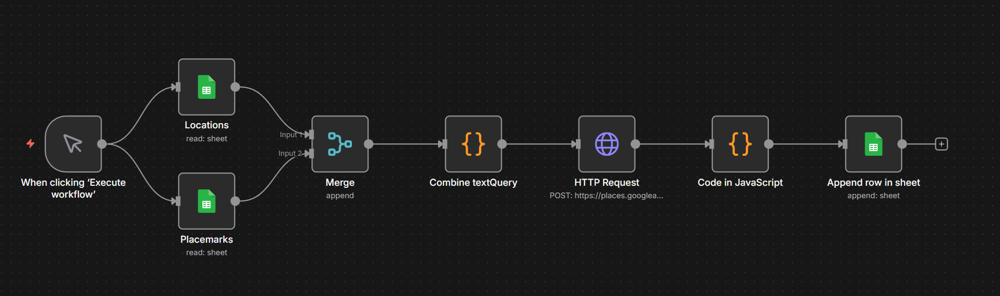
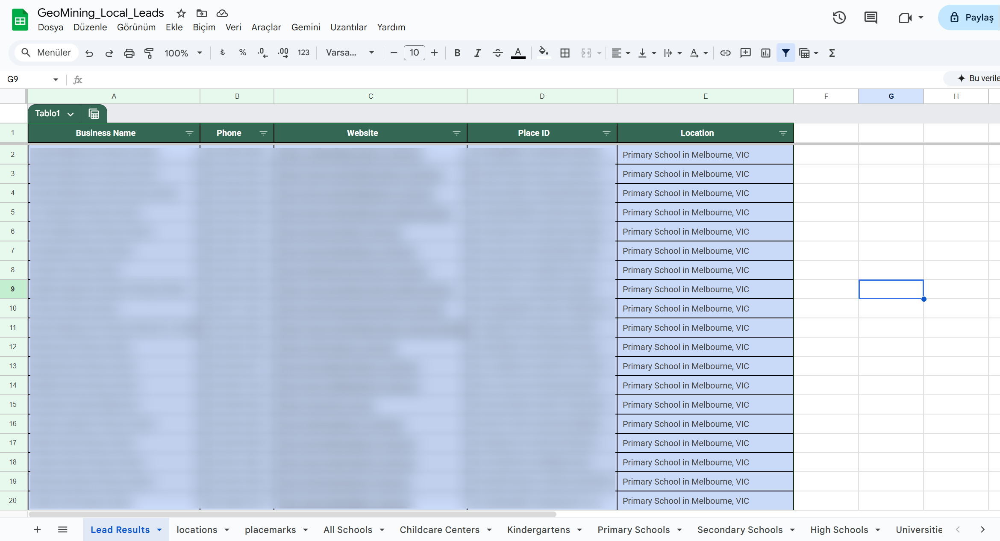

# Lead-Gen — Automated Local Business Data Mining

> An n8n automation workflow that extracts structured business data from Google Places API across multiple regions and industries, eliminating manual lead research entirely.

[](https://n8n.io/)
[](https://developers.google.com/maps/documentation/places/web-service)
[](https://www.google.com/sheets/about/)
[]()

---

## Overview

Lead-Gen empowers marketing and sales teams by automating the entire lead discovery process. Define your target regions and business categories in a Google Sheet, and the workflow handles everything — querying the Google Places API, normalizing nested responses, and streaming structured results back to your spreadsheet in real-time.

## Workflow Architecture



```
┌──────────────────┐     ┌──────────────────┐     ┌──────────────────┐
│  Google Sheets   │     │  Google Sheets    │     │                  │
│  (Locations Tab) │     │ (Placemarks Tab)  │     │  Merge Node      │
│                  │     │                   │     │  (Cartesian       │
│  Melbourne       │────►│  Dentists         │────►│   Product)       │
│  Sydney          │     │  Plumbers         │     │                  │
│  Brisbane        │     │  Electricians     │     │  "Dentists in    │
│                  │     │                   │     │   Melbourne"     │
└──────────────────┘     └──────────────────┘     └────────┬─────────┘
                                                           │
                                                  ┌────────▼─────────┐
                                                  │  Google Places   │
                                                  │  API (v1)        │
                                                  │  POST + FieldMask│
                                                  └────────┬─────────┘
                                                           │
                                                  ┌────────▼─────────┐
                                                  │  JS Normalizer   │
                                                  │  (Flatten JSON)  │
                                                  └────────┬─────────┘
                                                           │
                                                  ┌────────▼─────────┐
                                                  │  Google Sheets   │
                                                  │  (Lead Results)  │
                                                  └──────────────────┘
```

## Features

| Feature | Description |
|---------|-------------|
| **Dynamic Query Generation** | Automatically combines locations and categories into exhaustive search combinations |
| **Optimized API Calls** | `X-Goog-FieldMask` limits response to 5 essential fields, minimizing cost and latency |
| **Data Normalization** | Custom JavaScript flattens nested API responses into spreadsheet-ready rows |
| **Scalable Input** | Add new regions or industries directly in Google Sheets — no code changes needed |
| **Real-Time Output** | Results streamed directly to a Lead Results sheet as they are processed |

## Data Fields Extracted

| Field | Description |
|-------|-------------|
| Business Name | Display name from Google Places |
| Phone Number | Primary contact phone |
| Website | Business website URL |
| Place ID | Unique Google Places identifier |
| Search Location | Source query context for traceability |

## Engineering Challenges Solved

### Nested API Responses
Google Places API returns deeply nested JSON arrays incompatible with flat spreadsheet columns. A custom JavaScript function maps each business into a flat object while preserving search location context.

### Scalable Query Management
A Merge node combined with JavaScript loop logic generates a **Cartesian product** of all locations and categories, enabling exhaustive multi-region, multi-industry scanning in a single execution.

### API Cost Control
The `X-Goog-FieldMask` header strictly limits the response to five specific fields, minimizing data payload and staying within API quota limits.

## Results



- **Efficiency:** Transforms hours of manual copy-pasting into a one-click automated task
- **Data Integrity:** 100% accuracy in capturing business phone numbers and URLs
- **Scalability:** Plug-and-play — new regions or industries added without modifying code

## Setup

### Prerequisites

- n8n instance (cloud or self-hosted)
- Google Cloud project with Places API enabled
- Google Sheets API credentials

### Configuration

1. Import `Lead-Gen-Workflow.json` into your n8n dashboard
2. Connect your Google OAuth2 credentials
3. Create a Google Sheet with three tabs: **Locations**, **Placemarks**, **Lead Results**
4. Populate Locations and Placemarks with your target data
5. Activate the workflow

## Contact

GitHub: [sedat4ras](https://github.com/sedat4ras) | Email: sudo@sedataras.com
